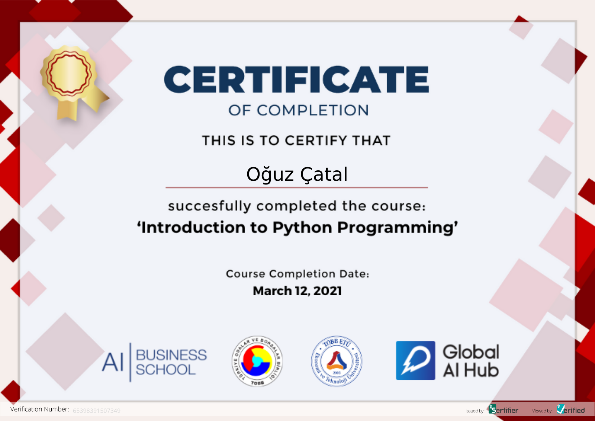

# GAIH Student Repo


**Course Date:** 08.03.2021  
**Name:** Oğuz  
**Surname:** Çatal  
**Email:** oguzcatal@gmail.com  

This repository is for holding information about homeworks and project of Global AI Hub - "Introduction to Machine Learning Course". Descriptions of the project are elaborated below.

## Default
Explain

## Requirements
 
```
import pandas as pd
import random

```
---

### Certification


